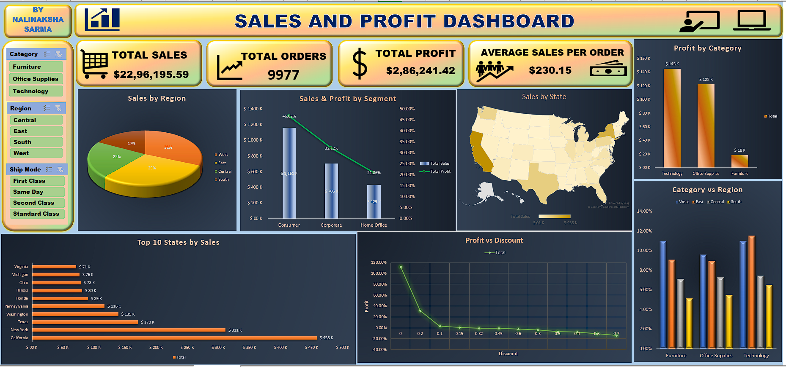

# Sample Superstore Data Analysis & Dashboard (Excel)

An end-to-end retail sales and profitability analysis conducted in Microsoft Excel, featuring pivot reporting and an interactive executive dashboard.

---

## 📊 Dashboard Preview

---

## 📁 Workbook Structure

- **SampleSuperstore:** Cleaned raw transactional dataset covering regional sales, categories, discounts, and profits.
- **Table:** Formatted Excel table with structured references for dynamic updates.
- **Pivot Analysis:** Summary tables detailing sales and margin performance by Segment, Region, and Sub-Category.
- **Dashboard:** Visual KPI cards, slicers, and interactive charts tracking core business metrics.

---

## 🔍 Key Insights

- **Profit Drivers:** High-margin sub-categories vs. areas with negative returns caused by steep discounting.
- **Regional Performance:** Regional breakdowns identifying the strongest customer segments (Consumer, Corporate, Home Office).
- **Discount Impact:** Thresholds where promotional discounts erode net operating profit.

---

## 🛠️ Tools & Excel Features Used

- Pivot Tables & Pivot Charts
- Slicers & Dynamic Filtering
- Summary Formulas (`XLOOKUP`, `SUMIFS`, conditional metrics)
- Data Formatting & Custom KPI Card Design
